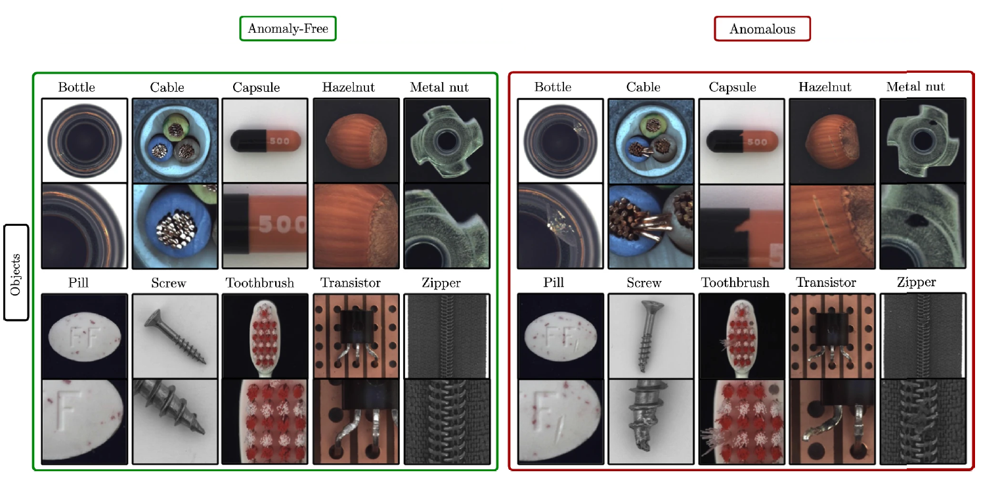

# Anomaly Detection Continual Learning

Continual Learning Approaches for Anomaly Detection (paper):   https://arxiv.org/abs/2212.11192

## Abstract

*Anomaly Detection is a relevant problem that arises in numerous real-world applications, especially when dealing with images. However, there has been little research for this task in the Continual Learning setting. In this work, we introduce a novel approach called SCALE (SCALing is Enough) to perform Compressed Replay in a framework for Anomaly Detection in Continual Learning setting. The proposed technique scales and compresses the original images using a Super Resolution model which, to the best of our knowledge, is studied for the first time in the Continual Learning setting. SCALE can achieve a high level of compression while maintaining a high level of image reconstruction quality. In conjunction with other Anomaly Detection approaches, it can achieve optimal results. To validate the proposed approach, we use a real-world dataset of images with pixel-based anomalies, with the scope to provide a reliable benchmark for Anomaly Detection in the context of Continual Learning, serving as a foundation for further advancements in the field.*

## Data

- Dataset used - [MVTec AD](https://openaccess.thecvf.com/content_CVPR_2019/html/Bergmann_MVTec_AD_--_A_Comprehensive_Real-World_Dataset_for_Unsupervised_Anomaly_CVPR_2019_paper.html)
- MVTec AD dataset is a recent and extensive industrial dataset that includes 5354 high-resolution images divided into 15
- categories: 5 types of textures and 10 types of objects.
- The training set only contains normal images, whereas the test set includes both defect and defect-free images.
- The image resolutions range from (700,700,3) to (1024,1024,3).
- Each training and test example is assigned to one of the following labels:

| Label | Description |
| --- | --- |
| 0 | Bottle |
| 1 | Cable |
| 2 | Capsule |
| 3 | Hazelnut |
| 4 | Metal Nut |
| 5 | Pill |
| 6 | Screw |
| 7 | Toothbrush |
| 8 | Transistor |
| 9 | Zipper |

## Project Structure

The project consists of the following components:

- configurations folder: Contains example of configuration files. Each file defines a specific model, strategy, etc.
- models folder: Contains all the models utilized in the project.
- trainer folder: Each model has an associated specific training within this folder.
- utilities folder: Contains various utilities for anomaly detection (AD), models, metrics, logging, etc.
- inpaint folder: Contains code used for the inpainting task
- datasets.py: Includes functions to import the mvtec dataset.
- loss_functions.py: This file contains the implemented loss functions.
- memory.py: Provides different memory modules used in the project, such as LatentReplay, GenerativeReplay, etc.
- metrics.py: Calculates evaluation metrics like f1, auc, recall, precision, etc.
- strategy_ad.py: Contains a class for training and evaluating the CL (Continual Learning) framework for AD tasks.
- main.py: Executes the test based on a configuration file and allows for the modification of various variables such as the model, CL strategy, etc.

## External code sources:

- To use the model Pix2Pix model: https://github.com/junyanz/pytorch-CycleGAN-and-pix2pix
- To calculate frechet-inception-distance (FID): https://github.com/hukkelas/pytorch-frechet-inception-distance
- Fastflow code was taken from anomalib: https://github.com/openvinotoolkit/anomalib

